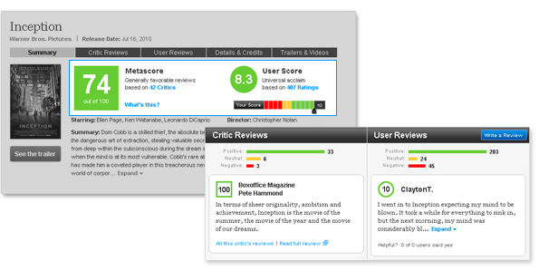
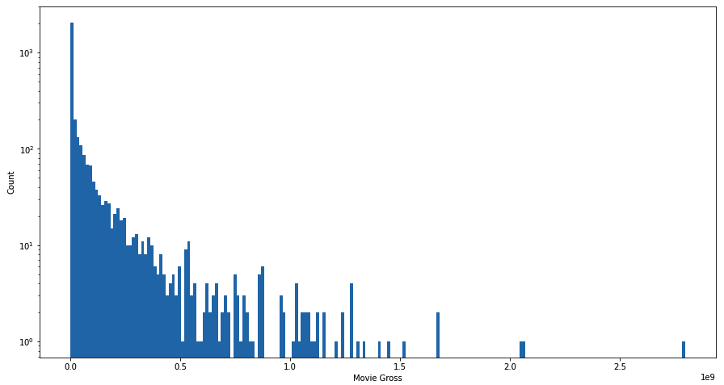
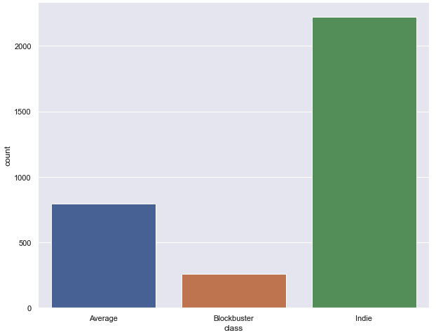
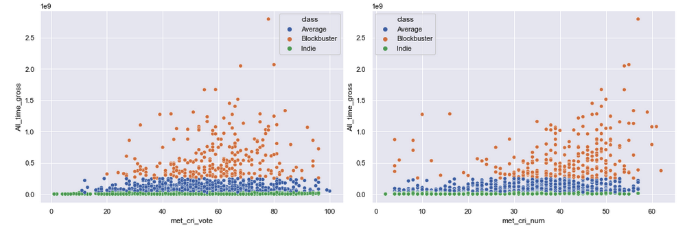
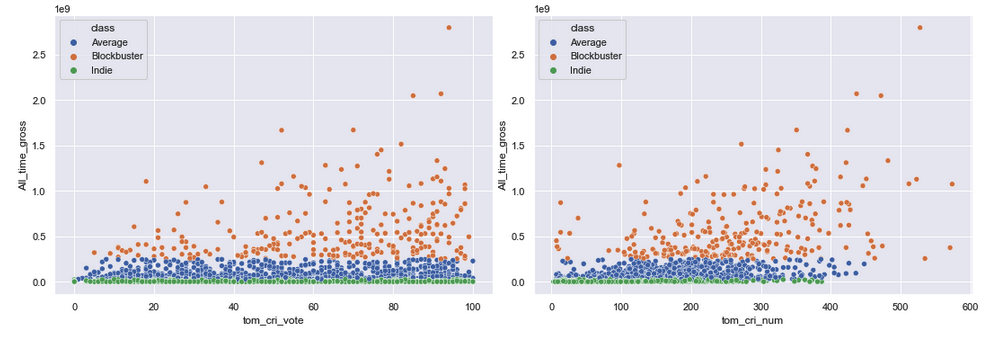
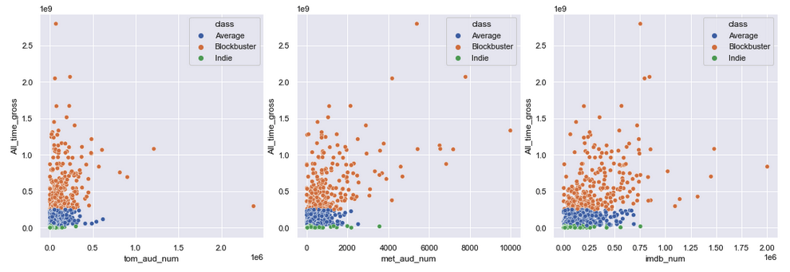

# Movie Box-office prediction based on early critic vote

The goal of this project is to predict the box-office of movies based on the rating from popular websites such as IMDB, Rotten Tomatoes and Metacritics. IMDB voting is only done by a user of the website who are regular movie viewers. Metacritics votes are done solely by critics and only normal users can see the rating. Rotten Tomatoes on the other hand has two rating systems; one for critics which is called Tomatometer and one for normal users which is called an audience score. First, I made a model using data to see how a combination of these votes can predict the box office and further to see different impacts of each type of voting (Audience and Critics) on the box-office prediction.

## 1.Data
The data set for this project consists of 3312 rating sets of movies. This dataset was gathered from 4 different sources:

•	Box office mojo website which provides data about the box-office of movies. Data was manually scraped from the website using Beautiful Soup library.
[Mojo data scraped](https://github.com/AminKafka/Movie_boxoffice_reviews/blob/main/notebooks/data_gathering.ipynb)

•	IMDB which can be found on Kaggle and consists of average vote, male vote, female vote, US vote and non-US vote accompanied by how many people voted for the movie.

•	Rotten Tomatoes which is also found on Kaggle. This set has both a value for critic vote and audience vote.
[Rotten Tomatto Dataset](https://www.kaggle.com/stefanoleone992/rotten-tomatoes-movies-and-critic-reviews-dataset?select=rotten_tomatoes_movies.csv)

•	Metacritic which was scraped manually from the website and consists of critics and audience vote average and vote counts.
[Metacritic data scraped](https://github.com/AminKafka/Movie_boxoffice_reviews/blob/main/notebooks/meta_scrap.ipynb)

## 2.Method

Predicting a box-office number is a supervised regression task. Features in the dataset consists of votes average and the number of critics/audience who voted. These features will be used as a predictor. Movie box-office will be the dependent variable. 

In the first step, I used all the features (including the early critics vote and audience votes that gatheres after the release of the movie and over time) as a predictor, to see how efficiently they can be used for the prediction purpose. I also try to see how diffrent regression model performed by using this data and pick the best model based on Mean absolute error.

Next I will attempt to make a separate model, only using the critic early votes information to see if we can have a prediction for the movie box-office before the movie release.

## 3.EDA

[EDA Report](https://github.com/AminKafka/Movie_boxoffice_reviews/blob/main/notebooks/EDA.ipynb)

* **Movie box-office** *

It is clear that the box-office variable has a long range between 10,000 to 2,000,000,000 and visibily it is not a continious value. That makes the prediction task which is based on the regression model, very hard and probably not acuurate. The dependant value in regression model needs to be a continious number in order to train the model for all the possible senario and therefore have a accurate predicition. So I can already imagine that model won't create a very accurate box-office prediction.

I decide to classify the movie box-office in three diffrent class. Blockbuster, average and Indie label created for each movie based on its box-office. This way beside getting a prediction for box-office, I can use my regression model, to predict which class movie will end up in. Based on early critic vote, the movie going to be a Blockbuster or average movie, or its going to sells less than 25 millions and classify as a Indie movie.

* **predictor values:Votes Data**

As the only predictor values, votes data consist of vote average and number of vote that gathered by the website. It is 18 columns gathered from three diffrent website, Metacritics, Rotten Tomatto and IMDB. For the finial goal of this project I only use the critics early vote columns from MEtacritic and Rotten Tomatto. All the 18 columns in other hand will used to see the general performance of a model consists of the vote information.

For the Metacritics it is clear that vote number show more linear coorolation with the box-office data. All three diffrent class also have a balanced distribution both in vote average and vote number.

Rotten tomatto critics vote number scatter plot has even more linearity in compare to Metacritics and I can assume that this columns will t have the most importance in prediction model.

Also just by taking a glance at the audience number, it is obvious that they have more coorolation with the box-office. Audience vote after the release of the movie and as the movie raise its popularity amoung the audience, they tends to vote higher. So I can also asuume here that the model only consist of the critics votes will performce worse than the model that used combination of audience and critics vote.

